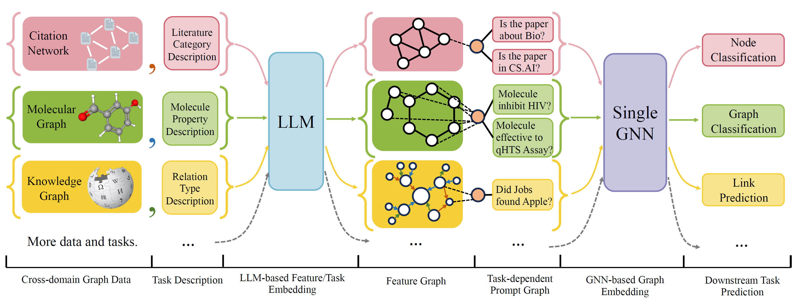

Ningyue Liang is an M.E. candidate in CSE at Harvard University. He graduated from Washington University in St. Louis as a valedictorian with double majors in Computer Science and Statistics. His profound interest in software engineering, machine learning, and AI, coupled with his industrial experience and academic achievements, marks him as an emerging professional equipped to face and solve complex technological challenges.

## Internship 

### Meta, Software Engineer Intern

*May 2025 – Aug. 2025; Menlo Park, CA*

###  Boondoggle AI, Software Engineer Intern                                                                                 

*June 2024 – Aug. 2024; San Francisco, CA (Remote)*

Skills: TypeScript, Python, React.JS, LangChain, NLP, LLM, Supabase  

Built generative AI solutions to streamline CRM operations, targeting support for 4,000+ clients by automating workflows

Developed automated pipelines with TypeScript, REST APIs, and GPT-4o (LLM) to create CRM contacts & deals by summarizing messages and interactions from LinkedIn and emails, reducing clients’ manual data entry by 70%

Enhanced the accuracy of our semantic search and querying system by integrating LangChain, Pinecone (Vector database), and RAG, improving data processing time by 30% and response quality based on user tests

Created non-blocking unified APIs to automate missing profile completion for major CRMs (Salesforce, HubSpot, etc.)

###  Impossible Sensing, LLC, Software Engineer Intern                                                                                 

*June 2023 – July 2023; St. Louis, MO*

Skills: Python, C++, REST API, Django, Flask, React.JS, OOP, PostgreSQL, AWS 			              

Collaborated with a cross-functional team of 5 to develop optical sensing software for NASA exploration detector projects, deploying scalable solutions on AWS using Docker to support over 1,000 users

Developed backend services with the Django MVT framework and REST APIs for record management, handling CRUD operations, data processing, and ML model predictions; implemented real-time camera image collection using OpenCV

Designed generic PostgreSQL schemas and a 2TB AWS RDS-based storage system for data management and replications

Crafted a responsive front-end interface using React.JS and Tailwind CSS, utilizing Dash for 8 interactive data visualizations

Enhanced IPC with async APIs and JSON-RPC for delay generators, improving timing control by 35% at millisecond levels

###  Sobriety Hub, LLC, Software Engineer Intern   

*May 2022 – Aug. 2022; St. Louis, MO*

[Project URL](https://github.com/NingyueLiang/SobrietyHub)

Skills: Next.JS, React.JS, REST API, PostgreSQL, OOP, AWS                                                                                             

Developed an operating management application for sober living homes and launched the website with over 500 users

Built Next.JS APIs and Prisma models to speed up event registration by 40% and support operating analysis functions

Created PostgreSQL schemas and built data upload functions with AWS EC2 & S3 for operation and record management

Implemented responsive frontend UI and data visualizations with React, D3.JS, and Chakra-UI, resulting in 30% more visits

<!-- ### Roke Data Co., Ltd., Software Engineer Intern                                                                                          

*May 2021 – July 2021; Jinan, China*
  
Skills: React.JS, Python, REST APIs, Odoo, PostgreSQL, D3.JS 

Developed an enterprise resource planning app to manage global construction projects for China Construction 8th Division

Implemented a database in PostgreSQL to store project planning information, including locations, resources, and status

Built non-blocking REST Python APIs to support resource planning functions and data analysis of construction projects 

Created an interactive data visualization in D3.JS to show 30+ projects’ progress, geospatial locations, and operations -->

## Research

### *One for All: Towards Training One Graph Model for All Classification Tasks* 
### Accepted for ICLR 2024 Spotlight presentation (top 5%)

Paper: [https://openreview.net/forum?id=4IT2pgc9v6](https://openreview.net/forum?id=4IT2pgc9v6)

Authors: Hao Liu, Jiarui Feng, Lecheng Kong, Ningyue Liang, Dacheng Tao, Yixin Chen, Muhan Zhang

[Github URL](https://github.com/NingyueLiang/OneForAll)

OFA is a general Graph Classification Framework that can solves a wide range of graph classification tasks with a single model and a single set of parameters. The tasks are cross-domain (e.g. citation network, molecular graph,...) and cross-tasks (e.g. few-shot, zero-shot, graph-level, node-leve,...)

OFA use natural languages to describe all graphs, and use a LLM to embed all description in the same embedding space, which enable cross-domain training using a single model.

OFA propose a prompting paradiagm that all task information are converted to prompt graph. So subsequence model is able to read tasks information and predict relavent target accordingly, without having to adjust model parameters and architecture. Hence, a single model can be cross-task.

OFA curated a list of graph datasets from a different sources and domains and describe nodes/edges in the graphs with a systematical decription protocol. We thank previous works including, [OGB](https://ogb.stanford.edu/), [GIMLET](https://github.com/zhao-ht/GIMLET/tree/master), [MoleculeNet](https://arxiv.org/abs/1703.00564), [GraphLLM](https://arxiv.org/pdf/2307.03393.pdf), and [villmow](https://github.com/villmow/datasets_knowledge_embedding/tree/master) for providing wonderful raw graph/text data that make our work possible.

###  *Advanced Astrophysics Telescope Program at Washington University in St. Louis*

Developed with a team of 6 to build a real-time localization system in C++ with object-oriented designs for GRB detections

Implemented reconstruction and localization algorithms with Compton formulas to handle energy data processed by FPGAs

Built an end-to-end ML infrastructure with Python and TensorFlow for preprocessing, training, and serving with 70M data

Optimized the localization pipeline by training and tuning with 40+ versions of regression models (including KNN, ANN, SVM, RF, and XGBoost), and improved its accuracy by 30%, achieving less than 1.5 degrees of error for 10k+ trials

## Project

### [1. Mirror iOS App](https://github.com/NingyueLiang/Mirror-iOS-App)

(Accepted by App Store, not published)
Introducing Mirror, the AI Interviewer App, powered by GPT and designed to help you ace your next interview! With Mirror, you can get a realistic mock practice of real interview questions, and receive real-time feedback from artificial intelligence on your performance. Mirror tracks your performance history, allowing you to see your progress and stay motivated. It’s a comprehensive tool that gives you everything you need to prepare for your interview with confidence.

### [2. Global Emissions Data Analysis & Interactive Visualizations](https://ningyueliang.github.io/Emssions/) 

Data Analysis and interactive visualizations on 30 years of greenhouse gas emissions for all countries in the world through D3.JS.

###  [3. EDUrain](https://github.com/NingyueLiang/EDUrain)
EDUrain is a platform dedicated to helping every student attend college. We help students file for scholarships for free, and offer a free housing search through our housing engine. Additionally, we’ve built into our platform other services to make the student’s life easier, including renter’s insurance, credit building, and roommate matching! We’re constantly improving our website as we build our startup, so look out for new features that are on the way!

## Teaching
I have worked as a teaching assistant for 7 Computer Science Courses and engineering tutor at Washington University in St. Louis:

CSE247 DATA STRUCTURES AND ALGORITHMS \
CSE204 WEB DEVELOPMENT \
CSE217 INTRODUCTION  TO DATA SCIENCE \
CSE330S RAPID PROTOTYPE DEVELOPMENT AND CREATIVE PROGRAMMING \
CSE332S OBJECT-ORIENTED SOFTWARE DEVELOPMENT LABORATORY \
CSE361S INTRODUCTION TO SYSTEMS SOFTWARE \
CSE438S MOBILE APPLICATION DEVELOPMENT 

## Tech Stack

 
<table>
<tbody>

<tr>
  <td align="center" width="20%">
  <b>
Java
</b> 

  </td>
  
  <td align="center" width="20%">
  <b>
Python
</b> 
  </td>
  
  <td align="center" width="20%">
  <b>
C++
</b> 

  </td>

</tr>

<tr>
  <td align="center" width="20%">
  <b>
ReactJS
</b> 

  </td>

  <td align="center" width="20%">
  <b>
Django
</b> 

  </td>

  <td align="center" width="20%">
  <b>
Spring
</b> 
  
  </td>
  
</tr>  

<tr>
  <td align="center" width="20%">
  <b>
PyTorch
</b> 

  </td>
  
  <td align="center" width="20%">
  <b>
TensorFlow
</b> 

  </td>
  

  <td align="center" width="20%">
  <b>
SQL
</b> 
 
  </td>
  

</tr>

<tr>
  <td align="center" width="20%">
  <b>
JavaScript
</b> 
  
  </td>
  
  <td align="center" width="20%">
  <b>
Swift
</b> 
  
  </td>
  

  <td align="center" width="20%">
  <b>
Golang
</b> 
  
  </td>
  

</tr>

<tr>
  <td align="center" width="20%">
  <b>
Git
</b> 
  
  </td>
  
  <td align="center" width="20%">
  <b>
Linux
</b> 

  </td>

  <td align="center" width="20%">
  <b>
Docker
</b> 

  </td>

</tr>

</tbody>
</table>

